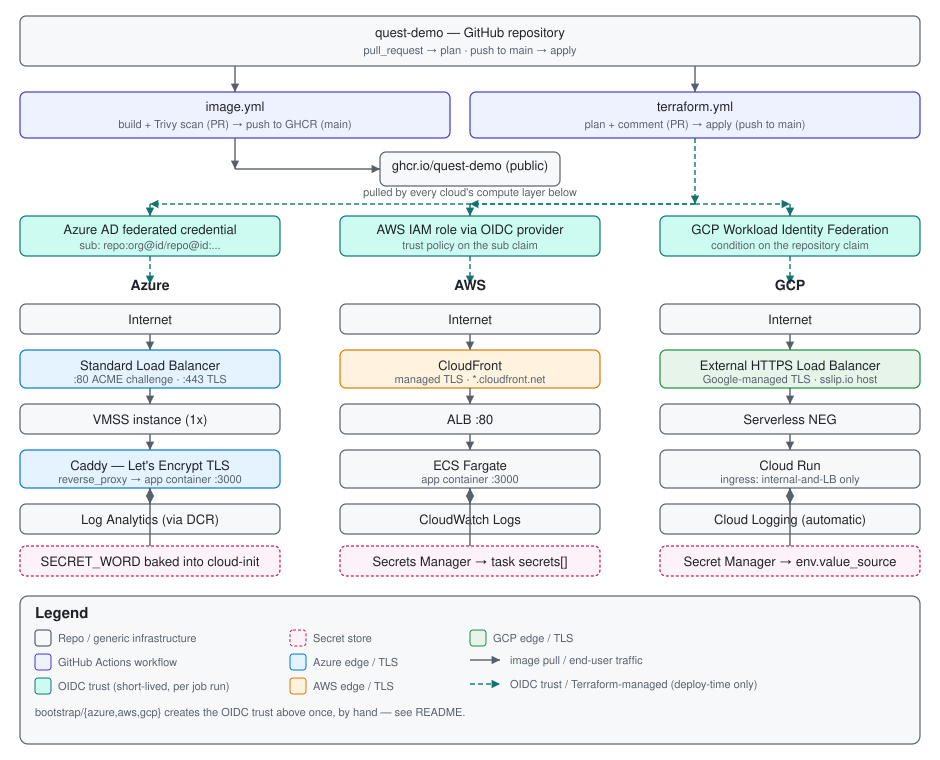

# quest-demo

A small Express app, containerized and deployed to Azure, AWS, and GCP simultaneously from one
Terraform codebase, each behind a load balancer with real TLS and centralized logging. CI/CD is
GitHub Actions end-to-end: image build/scan/push on PR and merge, Terraform plan on PR and apply
on merge, all authenticating via OIDC (no stored cloud credentials).

For the full build history, the reasoning behind each decision, and every gotcha hit along the
way, see [docs/plan.md](docs/plan.md). This README covers the current architecture and how to
maintain it.

## Architecture



| | Compute | TLS / edge | Logging | Secret |
|---|---|---|---|---|
| **Azure** | VMSS (1x `Standard_B2ts_v2`) behind a Standard Load Balancer | Caddy on the VM, Let's Encrypt cert for a `sslip.io` hostname | Log Analytics via a Data Collection Rule | Baked into cloud-init |
| **AWS** | ECS Fargate service behind an ALB | CloudFront, managed cert on `*.cloudfront.net` | CloudWatch Logs | Secrets Manager → task `secrets[]` |
| **GCP** | Cloud Run v2 (ingress locked to the LB) | External HTTPS Load Balancer + serverless NEG, managed cert for a `sslip.io` hostname | Cloud Logging (automatic) | Secret Manager → `env.value_source` |

Azure and GCP both use a free wildcard-DNS service (`<ip>.sslip.io`) instead of a purchased
domain, since neither cloud's usual managed-cert path (Front Door, classic CDN, Cloud Run's
default ingress) panned out here — see plan.md constraints #4, #8-9, and #12 for why.

## Repo layout

```
terraform/modules/{azure,aws,gcp}   # one self-contained module per cloud
env/dev/                            # root module: calls all three, owns the backend + providers
bootstrap/{azure,aws,gcp}           # one-time OIDC + state-storage setup, run by hand
.github/workflows/{image,terraform}.yml
```

`env/dev/main.tf` is the only place the three modules are wired together:

```hcl
module "azure" { source = "../../terraform/modules/azure"; ... }        # always on
module "aws"   { source = "../../terraform/modules/aws";   count = var.enable_aws ? 1 : 0 }
module "gcp"   { source = "../../terraform/modules/gcp";   count = var.enable_gcp ? 1 : 0 }
```

Each module takes the same shared inputs (`image`, `secret_word`, `app_port`, `tags`) and returns
one `endpoint_url` output. `env/dev` holds the only `provider` blocks and the `backend "azurerm"`
remote state config — the modules themselves declare no providers, so they can't drift from
whatever `env/dev` is authenticated as.

Adding a fourth cloud means: a new `terraform/modules/<cloud>/`, a new module block in
`env/dev/main.tf`, a new `bootstrap/<cloud>/` for its OIDC setup, and new `vars`/`secrets` in the
GitHub repo settings. Nothing else in the pipeline needs to change.

## CI/CD

- **`image.yml`** — on PR: build (no push) + Trivy scan, SARIF to the Security tab. On merge to
  `main`: build and push `ghcr.io/lukasmenne/quest-demo` tagged `sha-<short>` and `latest`.
- **`terraform.yml`** — on PR: `init` → `fmt` → `validate` → `plan`, plan summary posted as a
  sticky PR comment. On merge to `main`: `apply -auto-approve`.

Both jobs authenticate to all three clouds via OIDC before running Terraform — no stored
`AWS_ACCESS_KEY_ID`, Azure client secret, or GCP service-account key anywhere.

## OIDC setup

Each cloud's `bootstrap/` stack creates a trust relationship between this specific repo and a
short-lived-credential identity, scoped to `pull_request` events and pushes to `main` only. It's
applied once, by hand, with real credentials — `env/dev`'s own pipeline never touches it.

| Cloud | What `bootstrap/` creates | Trust condition |
|---|---|---|
| **Azure** | App registration + federated identity credential, `Contributor` on the subscription | `sub` == `repo:org@<org-id>/repo@<repo-id>:...` |
| **AWS** | IAM OIDC provider (`token.actions.githubusercontent.com`) + IAM role trust policy | Same `sub` format as Azure |
| **GCP** | Workload Identity Pool + Provider, service account bound to it | `repository` claim == `org/repo` (a separate, stable claim — unaffected by the `sub` format change below) |

GitHub rolled out an **immutable subject-claims** format in 2026 (`repo:org@<org-id>/repo@<repo-id>:...`
instead of the old `repo:org/repo:...`) for repos created after a certain date or opted in — both
the Azure and AWS trust conditions use the new format, since numeric IDs can't be spoofed by a
repo rename the way the plain owner/repo string could be.

At plan/apply time, each GitHub Actions job presents its workflow's OIDC token to the matching
cloud, which verifies the trust condition and hands back credentials valid only for that one job
run. There is no long-lived secret to rotate, leak, or expire.

**Non-sensitive identifiers** (client IDs, role ARNs, workload identity provider names, state
storage account names) are GitHub Actions **variables** (`vars.*`). The only real **secrets** are
`SECRET_WORD` (the app's own env var) and a placeholder GCP credential used until GCP OIDC is
fully wired per-environment.

## Day-2 operations

- **Change `SECRET_WORD`**: update the GitHub secret, then `terraform apply` (CI or by hand) —
  each cloud's secret-version resource updates in place. Don't `taint` the parent secret
  resource; that forces a destroy/recreate and can hit each cloud's own deletion-grace-period
  rules (AWS Secrets Manager in particular schedules a 30-day recovery window by default).
- **Change the app image**: `image.yml` pushes on every merge to `main`, but `TF_VAR_image` is
  the floating `:latest` tag — Terraform won't see a diff and won't redeploy on its own.
  Force a new revision per cloud (VMSS reimage, new ECS deployment, or `gcloud run deploy`) or
  switch to pinning the `sha-<short>` tag if this needs to be automatic.
- **Azure VMSS auto-recreates instances** (`upgrade_mode = "Automatic"`). Any fix that's only
  applied by hand to a running instance (e.g. via `az vmss run-command`) will not survive the
  next automatic recreation — always land the real fix in `cloud-init.yaml.tftpl` too.
- **Re-running `bootstrap/`**: safe to re-apply any time (e.g. to add a project IAM role) — it's
  ordinary Terraform state, just not wired into the automated pipeline.
